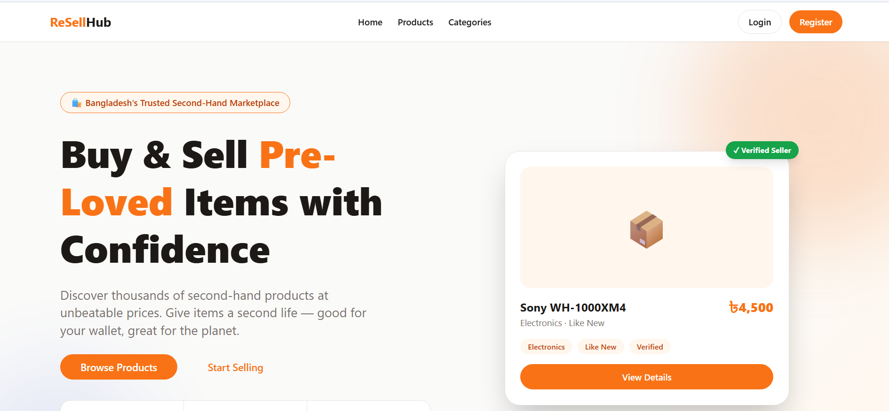
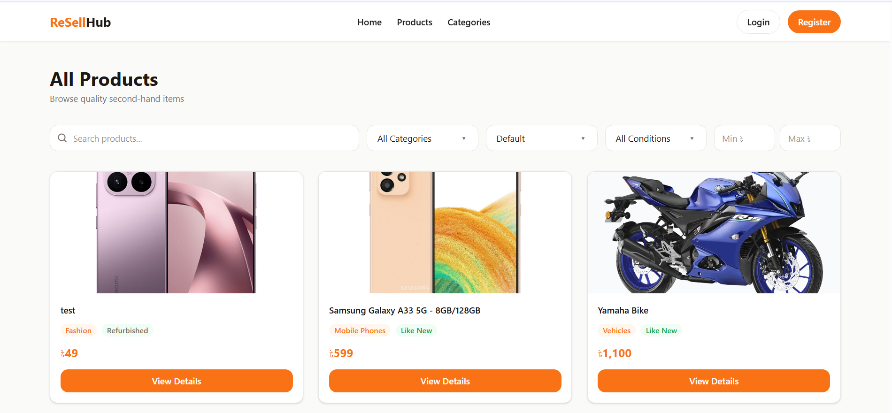
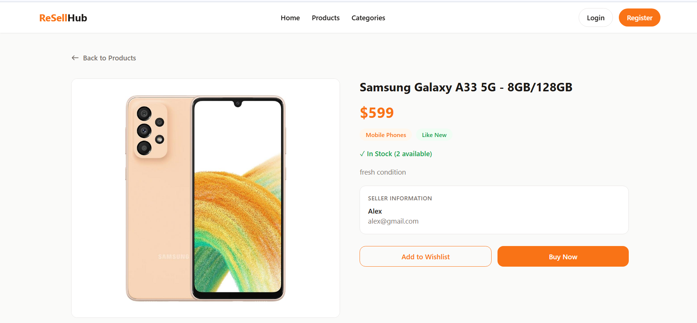
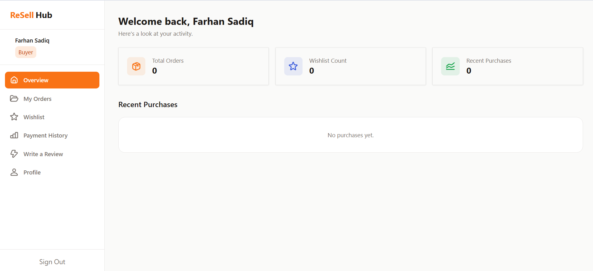

# ReSell Hub 🛍️

A modern second-hand marketplace platform where users can buy and sell pre-owned products safely and efficiently. This repo is the **client (frontend)** — built with Next.js, BetterAuth, and Stripe checkout integration.

🌐 **Live Site:** [https://resell-hub-client-xi.vercel.app](https://resell-hub-client-xi.vercel.app)
🔗 **Server Repo:** [resell-hub-server](https://github.com/farhansm01/resell-hub-server)

## 🎯 Project Purpose

ReSell Hub connects buyers and sellers of pre-owned products — reducing waste, promoting sustainable consumption, and letting users earn from items they no longer need, while buyers find quality products at affordable prices.

## 📸 Screenshots

### Homepage


### All Products


### Product Details


### Dashboard


## ✨ Key Features

### 🔐 Authentication
- Email & password registration and login
- Role-based registration — choose Buyer or Seller on signup
- Secure session management with BetterAuth
- Protected private routes and role-based access control

### 🏠 Home Page
- Dynamic Hero Banner with CTA and statistics
- Featured Products — latest approved listings
- Popular Categories — dynamic category cards with product counts
- Marketplace Statistics, Success Stories, Sustainability Impact section
- Trusted Sellers Showcase with Framer Motion animations

### 🛒 Marketplace
- All Products page with search, filter, sort, and pagination
- Advanced filtering — price range, condition, category
- Product Details page with seller details and reviews
- Wishlist functionality
- Category browsing with product counts

### 💳 Payment System
- Stripe Payment Gateway integration
- Checkout page with order summary and delivery info form
- Secure Stripe hosted checkout
- Payment Success page + payment history for buyers

### 👤 Buyer Dashboard
- Overview: total orders, wishlist count, recent purchases
- My Orders — view, track, cancel
- Wishlist management, Payment History, Write a Review, Profile management

### 🏪 Seller Dashboard
- Overview: total products, sales, revenue, pending orders
- Add Product with imgbb image upload
- My Products — view, edit, delete
- Manage Orders — accept, reject, update delivery status
- Sales Analytics with Recharts charts

### 🛡️ Admin Dashboard
- Overview with platform-wide statistics
- Manage Users, Products, Orders, Payments
- Platform Analytics with Recharts charts

### 🌟 Optional Features
- Recently Viewed Products — tracks last 4 viewed products per user
- Advanced Product Filtering — price range, condition, category

## 🗂️ Pages

**Public:** Home, All Products, Product Details, Categories, About Us, Contact Us, Login, Register
**Private:** Buyer Dashboard, Seller Dashboard, Admin Dashboard, Checkout, Payment Success

## Tech Stack (Client)
- [Next.js](https://nextjs.org/) (App Router)
- [React](https://react.dev/)
- [Tailwind CSS](https://tailwindcss.com/)
- [HeroUI](https://www.heroui.com/)
- [Gravity UI Icons](https://gravity-ui.com/)
- [Framer Motion](https://www.framer.com/motion/)
- [Recharts](https://recharts.org/)
- [React Toastify](https://fkhadra.github.io/react-toastify/)
- [Better Auth](https://www.better-auth.com/) (client)
- [Stripe.js](https://stripe.com/docs/js)

## Dependencies

| Package | Purpose |
|---|---|
| next | React framework (App Router) |
| react | UI library |
| tailwindcss | Utility-first CSS |
| @heroui/react | UI component library |
| @gravity-ui/icons | Icon library |
| framer-motion | Animations |
| recharts | Charts and analytics |
| react-toastify | Toast notifications |
| better-auth | Authentication |
| @stripe/stripe-js | Stripe client-side |

## Getting Started

### Prerequisites
- Node.js 18+
- A running instance of the [resell-hub-server](https://github.com/farhansm01/resell-hub-server) (locally or deployed)
- MongoDB Atlas account (used by BetterAuth on the client)
- Stripe account (publishable key)

### Clone & install
```bash
git clone https://github.com/farhansm01/resell-hub-client
cd resell-hub-client
npm install
```

### Environment Variables

Create a `.env` file in the project root:
```env
BETTER_AUTH_SECRET=your_secret
BETTER_AUTH_URL=http://localhost:3000
MONGODB_URI=your_mongodb_uri
NEXT_PUBLIC_BASE_URL=http://localhost:5000
NEXT_PUBLIC_STRIPE_PUBLISHABLE_KEY=your_stripe_publishable_key
```

### Run locally
```bash
npm run dev
```

## 🔒 Security
- Environment variables for all sensitive keys
- Role-based authorization (buyer / seller / admin)
- Admin account created manually — not accessible via registration

## 🎨 Color Palette

| Role | Hex |
|---|---|
| Primary | `#F97316` |
| Primary Dark | `#C2410C` |
| Secondary | `#3B5BDB` |
| Background | `#FAFAF9` |
| Text Primary | `#1C1917` |
| Text Secondary | `#78716C` |
| Success | `#16A34A` |
| Error | `#DC2626` |

## Deployment
Deployed on [Vercel](https://vercel.com).

## Related Repository
- 🔗 Server: [resell-hub-server](https://github.com/farhansm01/resell-hub-server)

## 👨‍💻 Developer

**Farhan Sadique Mohee**
- AIUB — Computer Science & Engineering
- Full Stack Developer (MERN Stack)
